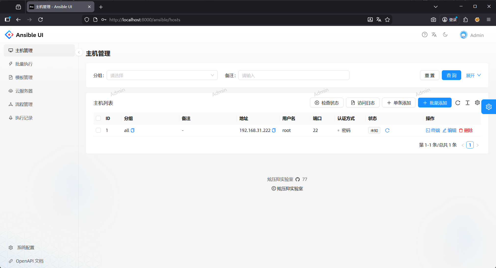
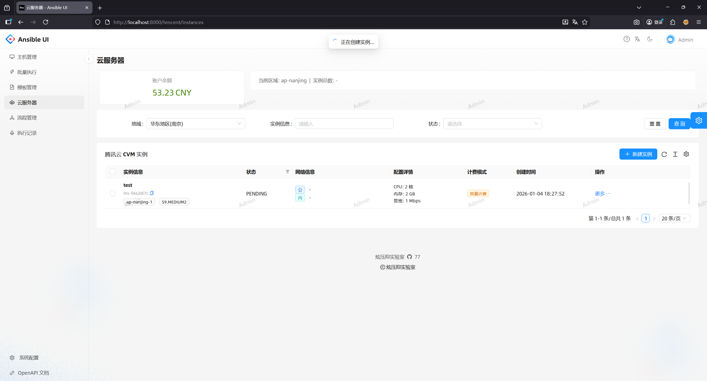
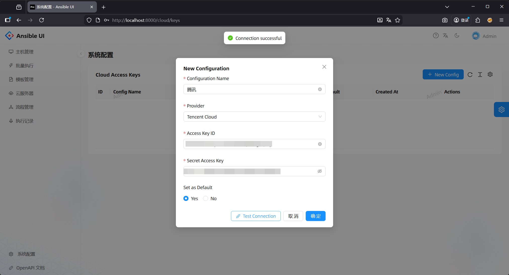
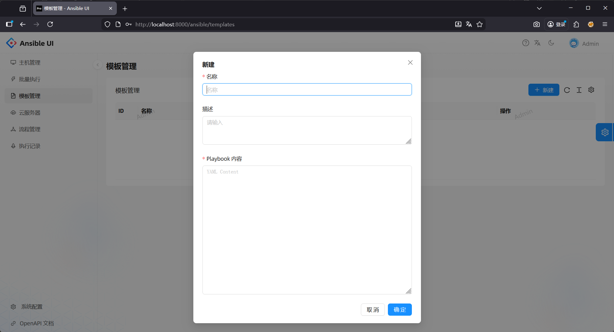
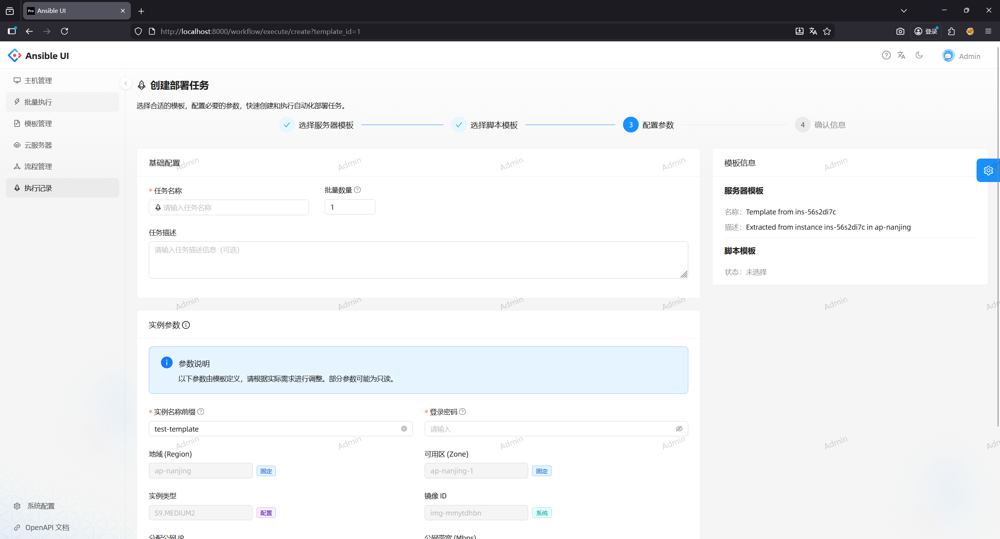
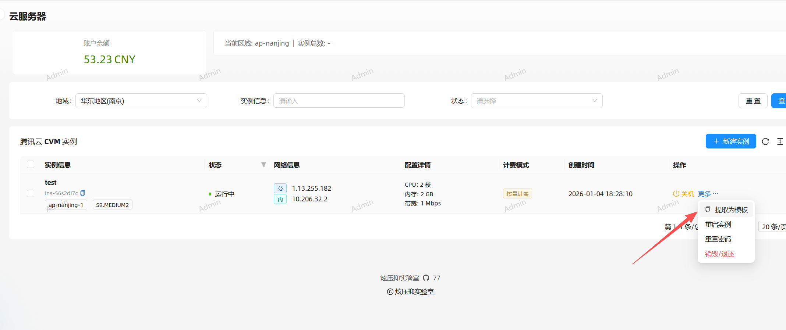
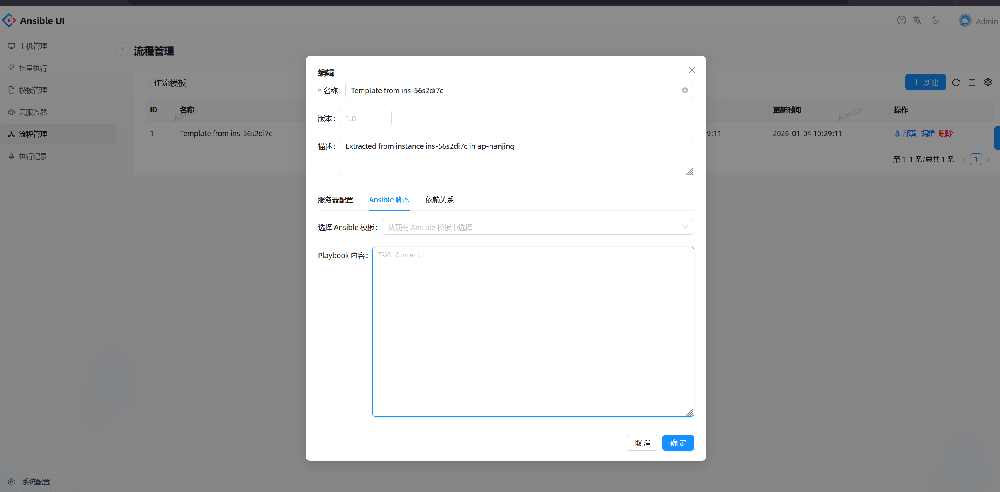
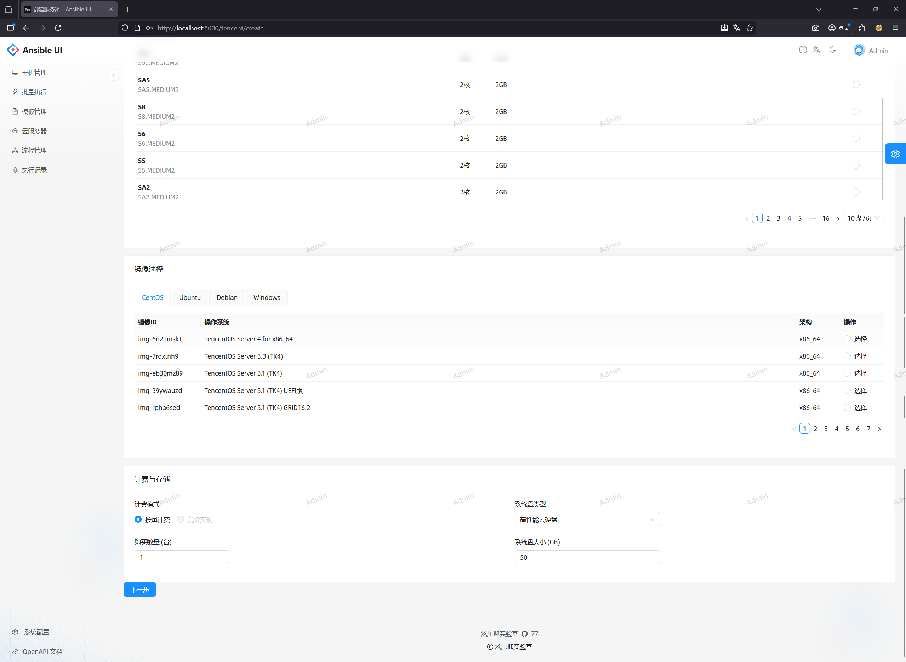
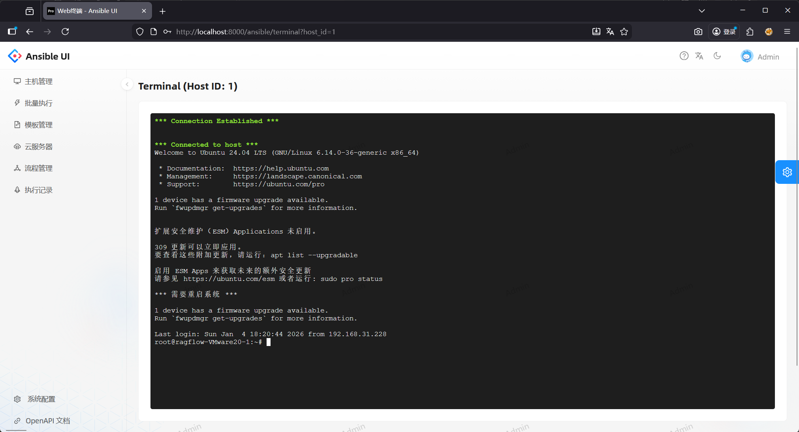

# Ansible Cloud - 现代化云原生运维管理平台

[](https://github.com/ansible/ansible)
[](https://www.python.org/)
[](https://fastapi.tiangolo.com/)
[](https://react.dev/)
[](https://www.docker.com/)

**Ansible Cloud** 是一个现代化的运维自动化管理平台，深度集成 Ansible 与腾讯云服务。它为运维团队提供了一站式的主机管理、自动化任务执行、云资源编排以及 Web 终端访问能力，极大地简化了混合云环境下的运维工作流。

## ✨ 核心功能

### 🖥️ 混合云主机管理

统一纳管本地与云端资源，实时掌握主机状态。



- **多云纳管**：统一管理本地服务器与腾讯云 CVM 实例。
- **自动同步**：支持后台自动同步腾讯云实例信息（IP、配置、状态）。
- **分组管理**：灵活的主机分组与标签系统。



#### 便捷认证
支持 SSH 密码与密钥认证，自动探测 SSH 连通性。



---

### 🚀 可视化 Ansible 编排

让自动化运维触手可及，支持从简单的命令执行到复杂的 Playbook 编排。



- **Ad-hoc 命令**：Web 界面快速执行 Shell 命令与 Ansible 模块。
- **Playbook 执行**：上传、编辑并执行 Playbook，实时查看任务进度。



- **模板提取**：支持将云实例配置提取为 Ansible 模板，实现基础设施即代码 (IaC)。



- **一键批量搭建**：基于模板快速构建业务环境。



- **实时日志**：WebSocket 实时推送任务执行日志，结果一目了然。

---

### ☁️ 腾讯云深度集成

无缝对接腾讯云 API，在单一控制台中管理云资源生命周期。



- **资源管理**：查看账户余额、地域/可用区分布、实例规格与镜像信息。
- **生命周期管理**：支持实例的创建、开机、关机、重启、重置密码及销毁/退还。
- **批量操作**：支持批量销毁云实例，释放闲置资源。

---

### 💻 Web 终端 (WebSSH)

随时随地访问您的服务器，无需安装任何客户端。



- **无需插件**：基于 WebSocket + xterm.js 的纯 Web 终端。
- **多会话支持**：同时管理多个 SSH 会话。
- **文件传输**：支持 SFTP 文件上传与下载。

---

### 🛡️ 安全与审计

- **操作审计**：记录关键操作日志与命令执行历史。
- **JWT 认证**：安全的身份验证机制。

## 🏗️ 技术架构

### 后端 (Backend)
- **框架**: FastAPI (Python 3.11)
- **任务队列**: BackgroundTasks (FastAPI Native)
- **数据库**: SQLite (轻量级，无需额外部署)
- **核心组件**:
  - `Ansible Runner`: 执行自动化任务
  - `Paramiko`: 处理 SSH 连接与密钥
  - `TencentCloud SDK`: 对接腾讯云 API

### 前端 (Frontend)
- **框架**: React 19 + UmiJS Max
- **UI 组件库**: Ant Design Pro 6
- **终端组件**: xterm.js
- **数据请求**: Axios + React Hooks

## 🚀 快速开始

### 方式一：使用 Docker Compose (推荐)

这是最快速的部署方式，适合测试与生产环境。

1. **克隆项目**
   ```bash
   git clone https://github.com/yourusername/ansible-cloud.git
   cd ansible-cloud
   ```

2. **配置文件**
   确保根目录下存在 `config.yaml` 文件（可参考仓库中的示例）。
   ```bash
   # 示例 config.yaml
   admin:
     username: admin
     password: admin123
   enable_login: true
   ```

3. **启动服务**
   ```bash
   docker-compose up -d
   ```

4. **访问系统**
   打开浏览器访问 `http://localhost:3000`
   - 默认账号: `admin`
   - 默认密码: `admin123`

### 方式二：本地开发部署

#### 后端环境

1. **Python 环境准备**
   建议使用 Python 3.11+
   ```bash
   cd ansible-cloud
   python -m venv venv
   source venv/bin/activate  # Windows: venv\Scripts\activate
   ```

2. **安装依赖**
   ```bash
   pip install -r requirements.txt
   ```
   *注意：Windows 环境下不支持原生 Ansible，部分功能可能受限。*

3. **启动后端**
   ```bash
   uvicorn app.main:app --reload --host 0.0.0.0 --port 8000
   ```

#### 前端环境

1. **Node.js 环境准备**
   需要 Node.js 20+ 及 pnpm。

2. **安装依赖**
   ```bash
   cd myapp
   pnpm install
   ```

3. **启动前端**
   ```bash
   pnpm dev
   ```
   前端服务将运行在 `http://localhost:8000` (开发模式下通常会有反向代理配置指向后端)。

## ⚙️ 配置说明

系统主要配置文件为 `config.yaml`：

| 配置项 | 说明 | 默认值 |
|---|---|---|
| `admin.username` | 管理员用户名 | admin |
| `admin.password` | 管理员密码 | admin123 |
| `enable_login` | 是否开启登录验证 | true |

*注意：腾讯云 AK/SK 请在系统登录后的“系统设置”页面进行配置，不需要写入配置文件。*

## 📁 目录结构

```
.
├── app/                 # 后端代码
│   ├── api/             # API 路由
│   ├── core/            # 核心配置与数据库连接
│   ├── models/          # Pydantic 模型
│   ├── services/        # 业务逻辑层 (Ansible, Tencent Cloud, etc.)
│   └── main.py          # 程序入口
├── myapp/               # 前端代码 (UmiJS)
│   ├── src/
│   │   ├── pages/       # 页面组件
│   │   └── services/    # 前端 API 定义
│   └── config/          # Umi 配置
├── db/                  # SQLite 数据库文件 (运行时生成)
├── logs/                # 系统日志 (运行时生成)
├── docker-compose.yaml  # Docker 编排文件
├── Dockerfile           # Docker 构建文件
└── config.yaml          # 系统配置文件
```

## 📄 License

[MIT License](LICENSE)
